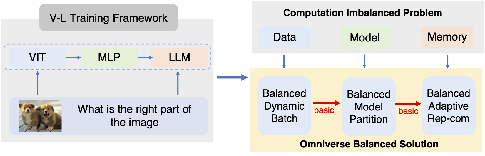
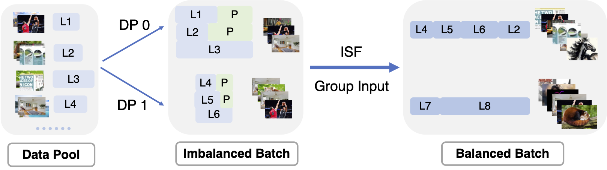

## OmniBal


Balanced Dynamic Mini-Batch for our paper
**[OmniBal: Towards Fast Instruct-tuning for Vision-Language Models via  Omniverse Computation Balance](https://arxiv.org/abs/2407.20761)**

### How to Run ISF


#### Prepare dataset length

We need to calculate offline statistics for all data, including the number of images and the token number of text.

We have already prepared the internvl-1.2M length information and placed it in the dataset.
test_balanced_dynamic_batch.py

#### Data Input

"internvl_sft_1.2M.json" is our simulated input, containing actual real statistical lengths.

The "Token_length" information consists of a list in this data format. "vit_num" represents the vision image batch size number in the current sample, "token_num" indicates the final text token length, and "image_flag" refers to the actual number of images in a sample. (Some plain text might generate fake images as dummy inputs to ensure training stability.)

```json
[
    {"vit_num": 5,
      "token_num": 811,
      "image_flag": 3
    },
    {"vit_num": 3,
      "token_num": 831,
      "image_flag": 3
    },
    {"vit_num": 1,
      "token_num": 310,
      "image_flag": 1
    },
    {"vit_num": 1,
      "token_num": 920,
      "image_flag": 0
    },
]

```

#### Get ISF arguments (vit bs num and llm token length)

```python
python test_balanced_dynamic_batch.py
```

*if you want to use fast version*

```
cd fast_isf
sh build.sh && cd ..
python test_balanced_dynamic_batch.py
```

#### Replace your dataset

The example implementation we provided is based on a fake dataset. For actual use, you need to replace it with your own dataset.

### Full Code

[Example](https://github.com/ModelTC/EasyLLM)


