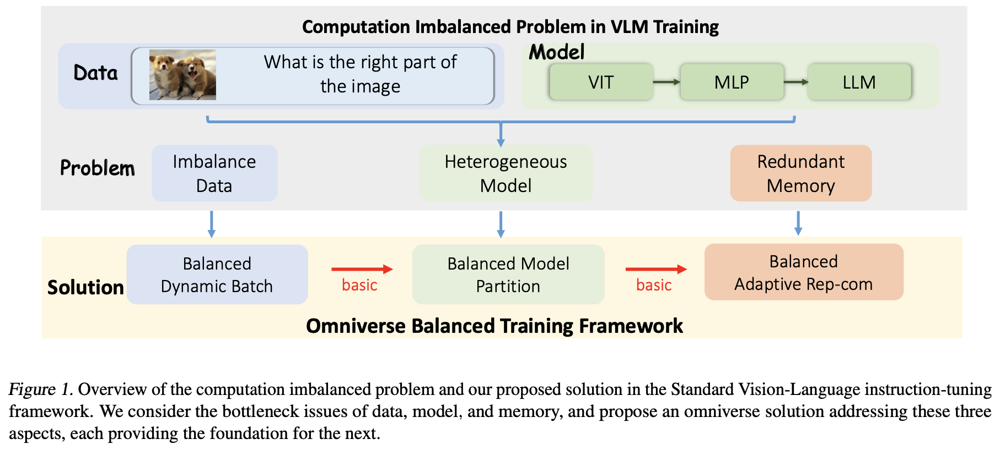
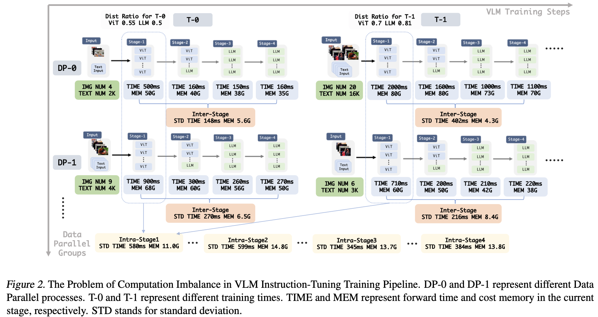
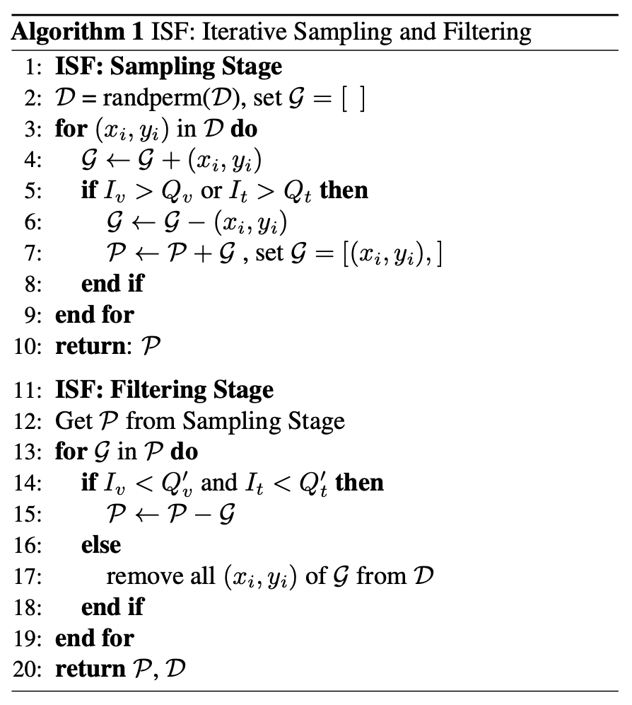
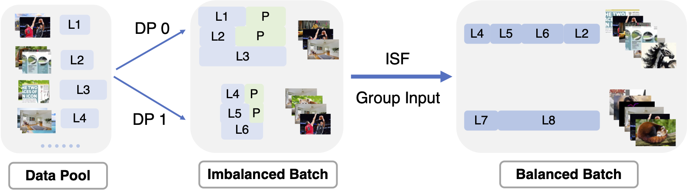

# OmniBal: Towards Fast Instruction-Tuning for Vision-Language Models via Omniverse Computation Balance

[](https://opensource.org/licenses/Apache-2.0)
[](https://arxiv.org/abs/2407.20761)
[](https://github.com/ModelTC/OmniBal)


[Yongqiang Yao*](https://github.com/yqyao), [Jingru Tan*](https://github.com/tztztztztz), [Feizhao Zhang*](), [Jiahao Hu](https://github.com/LitPrice), [Yazhe Niu](https://github.com/PaParaZz1), [Xin Jin](), [Bo Li](https://github.com/waveboo), [Pengfei Liu](https://scholar.google.com/citations?user=oIz_CYEAAAAJ&hl=en), [Ruihao Gong📧](https://xhplus.github.io/), [Dahua Lin](https://scholar.google.com/citations?user=GMzzRRUAAAAJ&hl=en) , [Ningyi Xu📧](http://www.qingyuan.sjtu.edu.cn/a/xu-ning-yi-1.html)
(* denotes equal contribution, 📧 denotes corresponding author.)

This is the official implementation of our paper **[OmniBal](https://arxiv.org/abs/2407.20761)**, an omniverse balanced training framework for large-scale 3D parallel training of vision-language models.  
End-to-end experiments on open-source VLMs show a **1.8x** training speed-up, and the method is model-, dataset-, and hardware-agnostic ready to plug into existing training pipelines with minimal changes.

## News
**May 1, 2025**: 🌟 Our paper has been accepted by ICML 2025! 🎉 Cheers!

## Overview

Large-scale vision-language instruction tuning often suffers from severe load imbalance across GPUs because the vision and language branches differ drastically in data distribution and network structure. **OmniBal** rebalances computation from three tightly coupled angles:

* **Data:** regrouping samples into mini-batches that equalize per-GPU FLOPs.
* **Model:** a search-based partitioner that assigns vision and language layers to devices for near-uniform workload.
* **Memory:** adaptive, per-partition re-compute policies that squeeze the most out of available memory without stalling kernels.

Together, these modules form an “omniverse” training framework that delivers **\~1.8 × end-to-end speed-up** on InternVL-Chat and consistently accelerates other VL models and datasets – all while maintaining accuracy.


### Framework



### Imbalance Problem In VLM



* **Inter-Stage**: computation imbalance of different pipeline parallel stages. 
* **Intra-Stage**: indicates the computation imbalance of the same stage across time and devices. 


## Balanced Dynamic Mini-Batch

* ISF Algorithm


* Example



### Prepare dataset length

We need to calculate offline statistics for all data, including the number of images and the token number of text.

We have already prepared the internvl-1.2M length information and placed it in the dataset.
test_balanced_dynamic_batch.py

### Data Input

"internvl_sft_1.2M.json" is our simulated input, containing actual real statistical lengths.

The "Token_length" information consists of a list in this data format. "vit_num" represents the vision image batch size number in the current sample, "token_num" indicates the final text token length, and "image_flag" refers to the actual number of images in a sample. (Some plain text might generate fake images as dummy inputs to ensure training stability.)

```json
[
    {"vit_num": 5,
      "token_num": 811,
      "image_flag": 3
    },
    {"vit_num": 3,
      "token_num": 831,
      "image_flag": 3
    },
    {"vit_num": 1,
      "token_num": 310,
      "image_flag": 1
    },
    {"vit_num": 1,
      "token_num": 920,
      "image_flag": 0
    },
]

```

### Get ISF arguments (vit bs num and llm token length)

```python
python test_balanced_dynamic_batch.py
```

*if you want to use fast version*

```
cd fast_isf
sh build.sh && cd ..
python test_balanced_dynamic_batch.py
```

### Replace your dataset

The example implementation we provided is based on a fake dataset. For actual use, you need to replace it with your own dataset.

## Code

### Data Example

[InternVL-Chat-V1.5](https://github.com/ModelTC/InternVL/tree/OmniBal_V1.5)

[InternVL-Chat-V2.0](https://github.com/ModelTC/InternVL/tree/OmniBal_V2.0)

[Xtuner-example](https://github.com/InternLM/xtuner/pull/906)

### Full Code

[Example](https://github.com/ModelTC/EasyLLM/tree/fast_vlm_dc_0713_paper)


## Citation
If you find this repository helpful, please cite the paper below.

```bibtex
@article{yao2024omnibal,
  title={OmniBal: Towards Fast Instruction-tuning for Vision-Language Models via Omniverse Computation Balance},
  author={Yao, Yongqiang and Tan, Jingru and Hu, Jiahao and Zhang, Feizhao and Jin, Xin and Li, Bo and Gong, Ruihao and Liu, Pengfei},
  journal={arXiv e-prints},
  pages={arXiv--2407},
  year={2024}
}
```

## License
This project utilizes certain datasets and checkpoints that are subject to their respective original licenses. Users must comply with all terms and conditions of these original licenses.
The content of this project itself is licensed under the [Apache license 2.0](./LICENSE).

## Acknowledgement

We build our project based on:
- [InternVL](https://github.com/OpenGVLab/InternVL)
- [LLaVA](https://github.com/haotian-liu/LLaVA)
- [DeepSpeed](https://github.com/microsoft/DeepSpeed.git)
- [Megatron-DeepSpeed](https://github.com/microsoft/Megatron-DeepSpeed.git)
- [Megatron-LM](https://github.com/NVIDIA/Megatron-LM.git)
- [Flash Attention 1&2](https://github.com/Dao-AILab/flash-attention)
- [LightLLM](https://github.com/ModelTC/lightllm)
- [Huggingface Transformers](https://github.com/huggingface/transformers.git)


